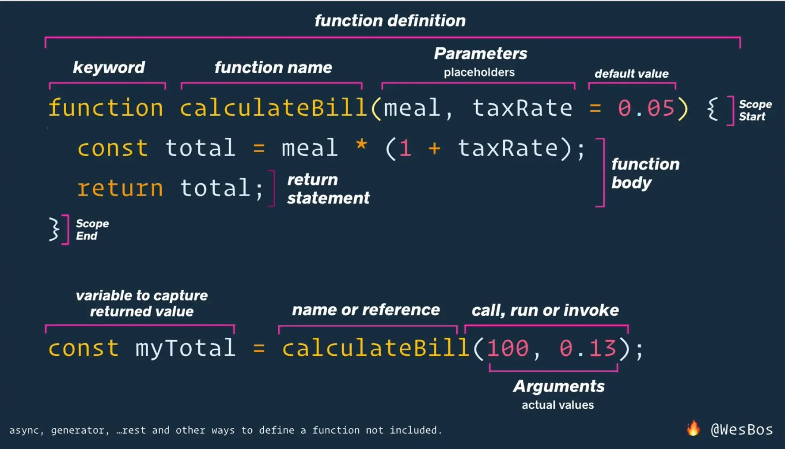

# JavaScript TIL

>## Variables

- Use `const` by default for anything that won't change (prevents bugs).
- Use `let` only if the value needs to be reassigned (like a counter in a loop).
- *Avoid `var`*—it's the "old way" and has weird scoping issues.

> ## Strings

###Template Literals
Instead of:
`"Hello " + name + "!"`
Use backticks:
`` `Hello ${name}!` ``
 cleaner and allows for multi-line strings.


> ## Numbers
 
### Special Numbers
#### NaN(not a number)
is a number even if it stands for not a number.
```js 
let notNumber = 0/0;
console.log(typeof notNumber); //returns number
```
common ways to get NaN 
```js
0 / 0          // NaN
"abc" * 3      // NaN
Number("hi")   // NaN
Math.sqrt(-1)  // NaN
```
NaN doesn't equal to anything even itself 
```NaN === NaN    // false```

#### Infinity 
Getting Infinity: 
```
1 / 0          // Infinity
-1 / 0         // -Infinity
Number.MAX_VALUE * 2 // Infinity
```
Checking for Infinity:
```
Number.isFinite(10)        // true
Number.isFinite(Infinity) // false
```

 ### Operator procedure 
**same as in maths**
if plus and minus comes together -> left to right
```javascript 
const result = 10 - 2 + 3;//its 11 not 5
```
exponents <- right to left 
```javascript 
const result = 2 ** 3 ** 2//512
```

 ### x++ and ++x
| Value |         Result                                      |
|-----------|----------------------------------------------------|
| x++   | Returns x, then adds 1                     |
| ++x   | Adds 1, then returns the new value |

> ## Boolean

### operartors
#### Equal
| Operator | Meaning |
|----------|---------|
| `=`      | Assign |
| `==`     | Equal (value) |
| `===`    | Strict equal (value + datatype) |

#### Inequal
| Operator | Meaning |
|----------|---------|
| `!=`     | Inequality |
| `!==`    | Strict inequality |

```js
console.log(5 == "5");   // true
console.log(5 === "5"); // false
```

#### Unary operators 

| Operator | Name | Example | Result |                                
|---------------|------------------|----------------|-----------|
|      +        | Unary Plus | +"5" | Converts the string "5" into the number 5. |
| - | Unary Negation  | -x | Flips the sign of x. |
| ++       | Increment       | x++        | Adds 1 to the value of x.             |
| --       | Decrement       | x--        | Subtracts 1 from the value of x.     |
| !        | Logical NOT     | !true      | Flips a boolean (becomes false).     |
| typeof   | Type Discovery  | typeof 10  | Returns its type (number)     |

### If...else 

- **[Falsy values](https://developer.mozilla.org/en-US/docs/Glossary/Falsy)** wont run inside an `if` condition.
- **Multiple conditions** are handled using `else if`.

##### Ternary Operator 

short form of if...else
```js
const weather = temperature > 25 ? 'sunny' : 'cool';
```
**Notes**
#### 1. Check Order
* Always check for **empty values** before proceeding with other logic.

#### 2. Assignment vs. Equality
* `=` is **Assignment**, not Comparison.
* `if (x = 5)`: Assigns `5` to `x`. This evaluates to **True**, and the block **will run**.
* `if (x = "")`: Assigns an empty string to `x`. This evaluates to **False**, and the block **will not run**


### Logical operators

- && --> returns the first falsy 
- || -> returns  truly  skips falsy 
- ?? -> returns the first non [null,undefined]
- ! -> turns it to the **opposite** boolean 
- !! -> turns it to  **correct** boolean 
- [more](https://developer.mozilla.org/en-US/docs/Web/JavaScript/Guide/Expressions_and_operators#logical_operators)
## Math object 

### Math Objects

- `Math.abs(x)` ---> absolute value of x
- `Math.ceil(x)` ---> round up
- `Math.floor(x)` ---> round down
- `Math.round(x)` ---> round to the nearest integer
- `Math.max(...nums)` ---> highest value among arguments
- `Math.min(...nums)` ---> lowest value among arguments
- `Math.pow(base, exp)` ---> base to the power of exp
- `Math.sqrt(x)` ---> square root of x
- `Math.random()` ---> random number between 0 and 1
- `Math.sin(x)` ---> sine of x (in radians)
- `Math.cos(x)` ---> cosine of x (in radians)
- `Math.PI` ---> value of Pi (~3.14159)
- `Math.trunc(x)` ---> remove fractional digits (integer part)
- `Math.sign(x)` ---> returns 1, -1, or 0 based on sign
- `Math.hypot(...nums)` ---> square root of the sum of squares
- `Math.cbrt(x)` ---> cube root of x
- [**more**](https://developer.mozilla.org/en-US/docs/Web/JavaScript/Reference/Global_Objects/Math)

#### random number between 1 and 10
```
Math.floor(Math.random()*10)+1
```
#### find the max no. 
```
Math.max(1,2,3)
```

#### find max no. from array 
```
const array = [1,2,3]
Math.max(...array)
```
`...` --> spread operator 

<<<<<<< HEAD


###  Number Methods 

#### 1. Checking for NaN
* **`isNaN(value)`**: **Coerces** (converts) the value to a number first.
    * *Risk:* Returns `true` for non-numeric strings (e.g., `isNaN("hello")` -> `true`).
* **`Number.isNaN(value)`**: **No coercion**. Strict check.
    * *Benefit:* Only returns `true` if the value is actually `NaN`.

#### 2. String to Number (`parseInt` vs `parseFloat`)
**Shared Traits:**
* Both handle leading whitespace and `+`/`-` signs.
* Both return `NaN` if the string starts with a non-convertible character.

| Feature | `parseInt()` | `parseFloat()` |
| :--- | :--- | :--- |
| **Decimals** | Chops them out (Truncates) | Keeps them |
| **Scientific Notation** | **No** (Stops at 'e') | **Yes** (Parses `"3.14e2"`) |
| **Radix Support(hex,binary)** | Yes (`parseInt(str, radix)`) | No (Always Base 10) |

#### 3. Formatting
* **`.toFixed(digits)`**:
    * Returns a **STRING**.
    * Rounds to the specific decimal count.
    * *Example:* `(3.567).toFixed(2)` -> `"3.57"`
### null and undefined 
```undefined```: - Unassigned variables        
                 - Function parameters without arguments 

```null```: - Intentional absence of value (set manually)
```undefined``` turns to NaN in numeric operations
```null>=0;//true```

Both represent absence of value.
Only equal to eachother and themselves.
Use strict equality specially while dealing with null with null, undefined .

### switch

````
switch(expression){
  case value1:
    // code
    break;
  case value2:
    // code
    break;
  default:
    // code    
}
````
uses ```===```
Better for 1 variable against many values.
not good for complex stuff


> ## Function



- **Default Value:** If no return is specified, the function returns `undefined`.
- **Return:** Used to return a specific value.

### Terminology
- **Parameter:** The **placeholder** (variable definition).
- **Argument:** The actual **value** passed.


### Default Parameter
​Definition: Runs (uses default value) when there are no arguments.
function greet(name = "guest") {
  console.log("Hello, " + name);
}
```
greet();       // "Hello, guest" (uses default)
greet("John"); // "Hello, John"
```


### Anonymous Function
- **Definition:** Has no name and is assigned to a variable.


```
const sum = function(num1, num2) {
  return num1 + num2;
};
```


### Arrow function 

**Normal Function**
```
function add(a, b) {
  return a + b;
}
```


**Anon Fun**
```
const add = function(a, b) {
  return a + b;
};
```


**Arrow**
```
const add = (a, b) => {
  return a + b;
};
```


**Arrow One Parameter**
```
const double = n => n * 2;
```


**Arrow No Braces (Implicit Return)**
```
const add = (a, b) => a + b;
```
### Scopes 
#### 1. Global  
- variables declared outside function or block.
- available everywhere.
#### 2. Local 
- variables declared inside a function.
- all variables (let ,const,var) respct it.
#### 3. Block
- variables declared inside curly brace(if,loops,function)
- var doesnt respect block (leaks out) unless its a  function


> ## Arrays
zero indexed
.length returns no. of elements 
dynamic(areays can be modified)

### push,pop,shift,unshift

push/pop work on the end of the array, while unshift/shift work on the beginning.

| Feature | `push` & `unshift` | `pop` & `shift` |
| :--- | :--- | :--- |
| **Action** | **Add** | **Remove** |
| **Returns** | New length | Removed element |

### distruction 
extract value from array and assigning each value a variable.
#### no distruction 
````
const colors = ['red', 'green', 'blue'];

const first = colors[0];
const second = colors[1];

console.log(first); // red
````
#### with distruction 
````
const colors = ['red', 'green', 'blue'];

// Unpacking the first two items
const [first, second] = colors;

console.log(first);  // red
console.log(second); // green

````
#### skipping values 
````
const fruits = ['Apple', 'Banana', 'Cherry', 'Dragonfruit'];

// We only want the first and the fourth item
const [first, , , fourth] = fruits;

console.log(first);  // Apple
console.log(fourth); // Dragonfruit
````
#### default values 
````
const settings = ['Dark Mode'];

// If the second item doesn't exist, it defaults to 'English'
const [theme, language = 'English'] = settings;

console.log(theme);    // Dark Mode
console.log(language); // English

````
#### reset synthax 
````
const podium = ['Gold', 'Silver', 'Bronze', '4th Place', '5th Place'];

const [winner, runnerUp, ...everyoneElse] = podium;

console.log(winner);       // Gold
console.log(everyoneElse); // ['Bronze', '4th Place', '5th Place']

````
#### reversing a string 

````
function revfun(string){
let array = string.split("");
let reversed = array.reverse();
let joined =reversed. join("");
return joined
}
console.log(revfun("hello"));//olleh
````

